# 📈 Enterprise Lead Pipeline Health Monitor

> **Reference Architecture:** A proactive monitoring system designed to eliminate "Silent Failures" in digital marketing pipelines. It audits lead ingestion across multiple business units and triggers automated alerts if any channel becomes inactive.

---

## ⚠️ Portfolio Note & Disclaimer

This repository presents a **sanitized reference implementation**. The logic and architecture are inspired by high-stakes production systems developed during my professional experience. 

*   **Legal Compliance:** All proprietary business data and real brand names have been replaced with generic mocks.
*   **IP Protection:** This is a secondary, independent implementation created for educational purposes, ensuring 100% compliance with NDAs.

---

## 📌 The Business Problem: Eliminating "Silent Failures"

In multi-brand digital marketing, the most dangerous threat is a **"Silent Failure"**. This occurs when a lead form breaks (API updates, plugin conflicts), but the team remains unaware because there is no error message—just a sudden stop in lead flow.

This system provides a proactive safety net by monitoring lead ingestion across multiple sectors (Retail, Manufacturing, Agrotechnology) and alerting the team if a channel shows zero activity over a rolling 7-day period.

---

## 🛠️ System Architecture

The monitor operates on a 7-day rolling window, comparing live ingestion data against a pre-defined list of critical marketing channels.

```mermaid
graph LR
    Timer[Weekly Trigger] --> Fetch[Fetch Lead Data]
    Fetch --> Analysis{JS Code}
    
    subgraph "Logic Layer"
    Analysis -->|Last lead > 7 days| Alert[⚠️ Trigger Alert]
    Analysis -->|Active| Log[✅ System Healthy]
    end
    
    Alert --> Email[Outlook Optimized Report]
    Log --> Email
```

## 🚀 Key Features

*   **Logic-Based Monitoring (JS Engine):** The system utilizes a custom JavaScript engine for precise date filtering and channel analysis. By using deterministic logic instead of AI for calculations, we ensure 100% accuracy and eliminate the risk of hallucinations in system health reporting.
*   **Contains-Based Matching:** Flexible channel identification. The system remains resilient even if form names on the website are slightly modified (e.g., due to plugin updates or CMS changes).
*   **Calendar-Day Logic:** Normalizes "Days Ago" calculations. The system ignores hours and minutes to provide managers with intuitive "1 day ago" reporting (instead of "22 hours ago"), allowing for instant status assessment.
*   **Outlook-Safe UI Design:** Since 90% of enterprise reports are viewed in Outlook, the report interface is built using a robust HTML table architecture, guaranteeing perfect rendering across all devices and legacy mail clients.

---

## 🧠 Engineering Challenges & Solutions

### 1. Eliminating "Silent Failures"
**Problem:** Contact forms often fail "silently" (e.g., after a WordPress update). Marketing teams receive no error messages—leads simply stop arriving, leading to significant revenue loss.  
**Solution:** Implemented a proactive "7-day Lookback Monitor." The JS script audits all channels weekly and sends a "Health Check" report, detecting zero-lead scenarios before they become a crisis.

### 2. Outlook Compatibility (The Rendering Gap)
**Problem:** Modern CSS/HTML code often breaks in Microsoft Outlook (which uses the Word rendering engine).  
**Solution:** Developed an email architecture based on classic HTML tables and inline styles (legacy-safe CSS). This ensures the report is perfectly readable on both mobile devices and the desktop Outlook app.

### 3. Dynamic Channel Mapping
**Problem:** In large organizations with multiple brands and dozens of forms, manually adding every ID to the monitor is unmaintainable.  
**Solution:** Leveraged "Contains-Based Identification" logic. The system automatically categorizes leads into business units (e.g., Agri, Industrial, Logistics) based on string patterns, making the system virtually maintenance-free.

---

## 📂 Repository Structure

*   `logic_reference.js`: The core JavaScript (Node.js) engine responsible for date logic and channel categorization.
*   `workflow_mock.json`: A sanitized n8n workflow file, ready for direct import into your instance.
*   `/docs`: Storage for report preview screenshots and UI examples.

---

## 🤝 Transparency: Human vs. AI Role

*   **My Role (Architect):** Designed the monitoring architecture, defined alert thresholds (7 days), and created the channel matching logic. Developed the email report structure tailored for business stakeholders.
*   **AI Role:** Assisted in generating boilerplate JavaScript for date manipulation and crafting legacy-compliant HTML tables for Outlook compatibility.

---

## 🚀 Deployment Requirements

*   **Orchestrator:** n8n (Self-hosted via Docker recommended)
*   **Data Source:** Google Sheets API (or any lead log database)
*   **Authorization:** Google Cloud Platform (OAuth 2.0)
*   **Delivery:** Gmail API / SMTP

---

**[Twoje Imię i Nazwisko]**  
AI Automation Architect / MarTech Specialist  
[Twój Link do LinkedIn]
